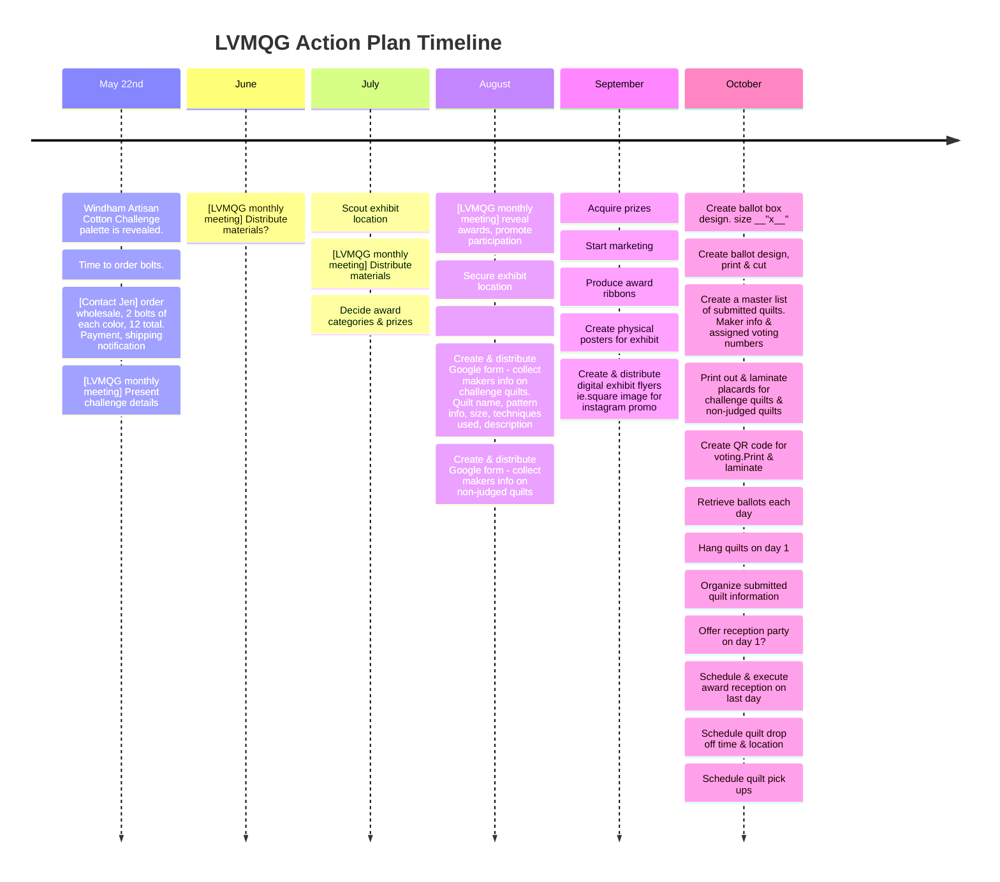
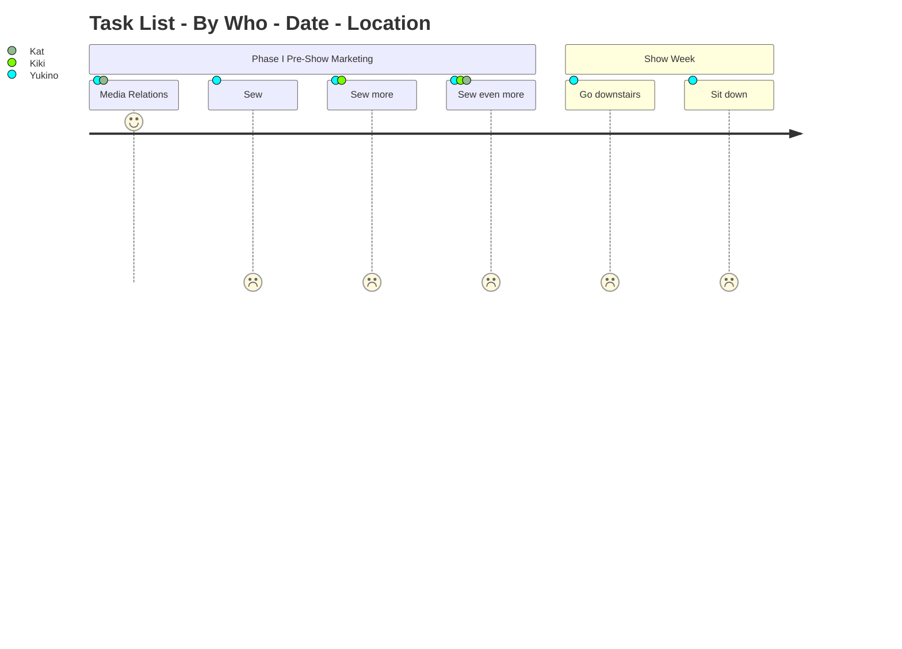

# [Windham Artisan Cotton 2024 Fabric Challenge](https://quiltcon.com/windham-challenge/)

## Details

### Hosted By

Fabric Challenge quilts must use at least 3 of the 6 challenge fabrics — no other fabrics may be used on the front of the quilts.
If the binding is visible from the front of the quilt, it must be in one of the palette fabrics — the backing may be any fabric. If the quilt is faced and does not have binding that appears on the front of the quilt, the facing can be of any fabric.
Size restrictions follow the same standard as all QuiltCon quilts — there is no minimum size — there is a maximum of 440″ total perimeter (with no single side larger than 110″).
Quilt entries will be open from September 1 to October 31, 2023 (the same as all QuiltCon show entries).

https://www.hancocks-paducah.com/search?keywords=artisan%20cotton&page=1

$9.99/yd, $100+ Free Shipping at Hancocks of Paducah (as of 2023)

https://www.sewtopia.com/product-tag/windham-artisan-cotton-2024-challenge/

$11/yd, No free shipping at Sewtopia (as of 2023)

___

## Action Plan

### Timeline

Items to have on day 1 of show: Hanging quilts
* index cards
* sharpie
* masking tape
* push pins 200+
* safety pins - various sizes
* stapler - to hang quilts on walls
* laminated numbers
* placards with challenge quilt info
* placards with non-judged quilt info
* QR code sign for digital voting 
* poster - description of challenge
* poster - who LVMQG is
* table signages 
* A notebook for viewes to sign + pen. Collect emails.
* LVMQG flyers
* LVMQG official quilt (hang signage with pattern design, maker and quilter info)
* folding table
* table cloth
* ladder
* ballot box
* ballots
* pens
* posters

Promotion Action Plan
* Email past year's attendees from LVMQG account
* Facebook - other guilds
* Nearby local quilt shops 
* LVMQG blog
* Local news
* Local newspapers
* Podcasts, youtubers, local libraries

Exhibit Location Contact

Sew Yeah Quilting Class Event Coordinator - Kartor 725-250-0887

### Who, What, When

